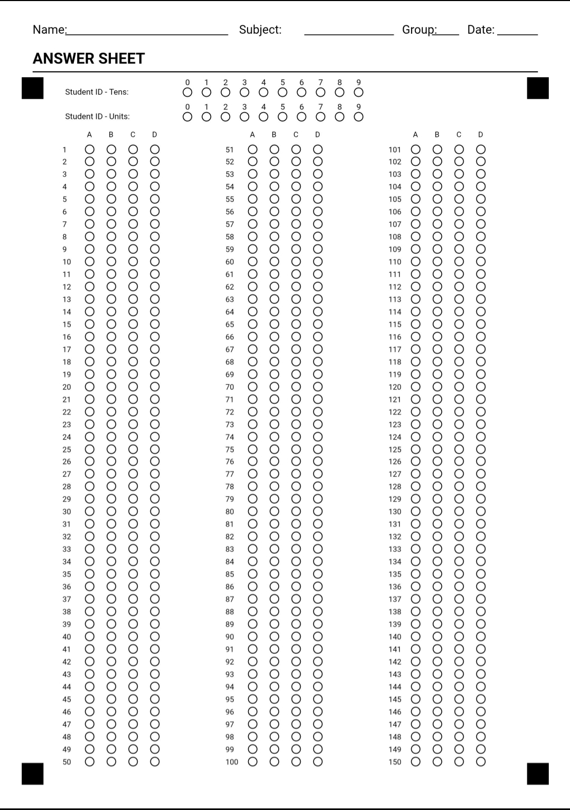

# 📝 Complete OMR Suite

> **A multi-engine, privacy-first solution to generate, personalize, and automatically grade Optical Mark Recognition (OMR) exam sheets.**

[](https://drfperez.neocities.org/quiz/3languages/)
[](https://opensource.org/licenses/MIT)
[](#)
[](#)
[](#)

---

## 🌐 Live Demo

Try the single-file web application directly in your browser with zero installation or setup:

👉 **[Launch Web Live Demo](https://drfperez.neocities.org/quiz/3languages/)**

---

## 🌟 Key Features

* **🔒 Privacy-First & Offline Ready:** Everything in the web app runs client-side inside the user's browser. No student data or exam scans ever touch a server.
* **📄 Integrated Sheet & Pauta Generator:**
  * Generate blank exam templates (up to 150 questions, 4 options: A, B, C, D).
  * Generate filled teacher answer keys (*pautas*) in high-resolution JPG or printable A4 PDF.
  * Create dummy student exam sheets for testing and validation.
* **👥 Personalization Engine:**
  * Batch-generate multi-page PDFs customized for specific classes.
  * Pre-prints student names, exam titles, headers, and bubbled 2-digit numeric IDs (00–99).
* **🤖 Computer Vision Pipeline:**
  * **Perspective Correction:** Uses 4-corner fiducial alignment markers to automatically correct rotation, tilt, and perspective skew.
  * **Bubble Intensity Extraction:** Measures ROI pixel density to accurately read marked choices and IDs.
  * **Custom Scoring:** Flexible penalty formula for wrong answers, automatic handling of blank or multiple-bubble invalid marks.
  * **CSV Reporting:** One-click export with Student ID, Correct, Errors, Blanks, and Final Score (/10).
* **🌍 Multilingual Interface:** Native UI support for **English**, **Spanish (Español)**, and **Catalan (Català)**.

---

## 📊 Processing Engine Comparison

Choose the right workflow based on your workload and environment:

| Feature / Metric | 🌐 Web App (OpenCV.js) | 🐍 Python / Google Colab | ⚡ Native C++ Binary |
| :--- | :--- | :--- | :--- |
| **Primary Use Case** | Standard classroom grading, zero setup | Heavy bulk processing, cloud pipelines | Max performance, standalone desktop app |
| **Installation** | 🟢 None (Runs in browser) | 🟡 Google Colab or Python 3.x | 🔴 Compiler & OpenCV required |
| **Batch Capacity** | ~50–100 exams per batch | 🟢 Unlimited (Cloud/System RAM) | 🟢 Unlimited |
| **Startup Speed** | 🟢 Instant | 🟡 Medium (Interpreter load) | 🟢 Instant (< 0.01s) |
| **Executable Size** | N/A (Single HTML file) | ~150–200 MB (if built via `.exe`) | 🟢 ~5–10 MB standalone |

---

## 🛠️ Tech Stack

* **Web Engine:** HTML5, CSS3, Vanilla JavaScript (ES6+), OpenCV.js (WebAssembly), jsPDF, HTML5 Canvas.
* **Python Engine:** Python 3.x, OpenCV (`opencv-python`), Pandas, Pillow, Google Colab.
* **Native Engine:** Modern C++ (C++17), Native OpenCV 4.x.

---

## ⚙️ How the Vision Pipeline Works

1. **Thresholding & Contour Detection:** The scan is converted to grayscale and binarized using inverse thresholding.
2. **Fiducial Marker Identification:** The engine searches for the 4 square orientation blocks located near the sheet corners.
3. **Perspective Transformation (`warpPerspective`):** Using the centers of the 4 markers, a homography matrix is calculated to warp and normalize the image to a fixed `1050x1485` grid.
4. **ROI Dark Pixel Ratio Analysis:** For every bubble coordinate, a region of interest (ROI) is sampled. If the ratio of dark pixels (`< 120` intensity) exceeds the threshold (`> 40%`), the bubble is registered as marked.

---

## 🚀 Quick Start & Usage Guide

### 1. Web Application (Zero Setup)
1. Open the [Live Demo](https://drfperez.neocities.org/quiz/3languages/) or download `index.html` locally.
2. Open `index.html` in any web browser.
3. Generate your answer sheets, upload the teacher key image, and grade student sheets directly.

### 2. Python & Google Colab (For Heavy Workloads)
Web browsers enforce strict memory limits per tab. For grading large batches (hundreds of high-res images), use the included Jupyter notebook:

👉 **[Open Notebook in Google Colab](https://colab.research.google.com/github/drfperez/OMRSuite/blob/main/OMRSuite.ipynb)**

* **Local Python Execution:**
  ```bash
  pip install opencv-python pandas pillow
  python OMRSuite.py

  
### 3. Native C++ Binary (For Maximum Desktop Speed)
For dedicated local builds with minimal executable sizes and instant startup:

#### Prerequisites
* C++17 compliant compiler (`g++`, `clang++`, or MSVC)
* [OpenCV 4.x C++ Development Libraries](https://opencv.org/releases/) installed

#### Compilation (Linux / macOS / MinGW):
```bash
g++ -O3 main.cpp -o omr_engine `pkg-config --cflags --libs opencv4`

---

## 📸 Sample Answer Sheet

Below is a preview of the standard A4 150-question OMR template (`template.jpg`):

<p align="center">
  
</p>

* **Capacity:** 150 Multiple Choice Questions (3 columns of 50).
* **Options:** 4 options per question (A, B, C, D).
* **ID Area:** 2-digit numeric student ID grid (00–99).
* **Alignment:** 4 corner fiducial registration markers.

---

## 📄 License

This project is open-source and available under the [MIT License](LICENSE).

